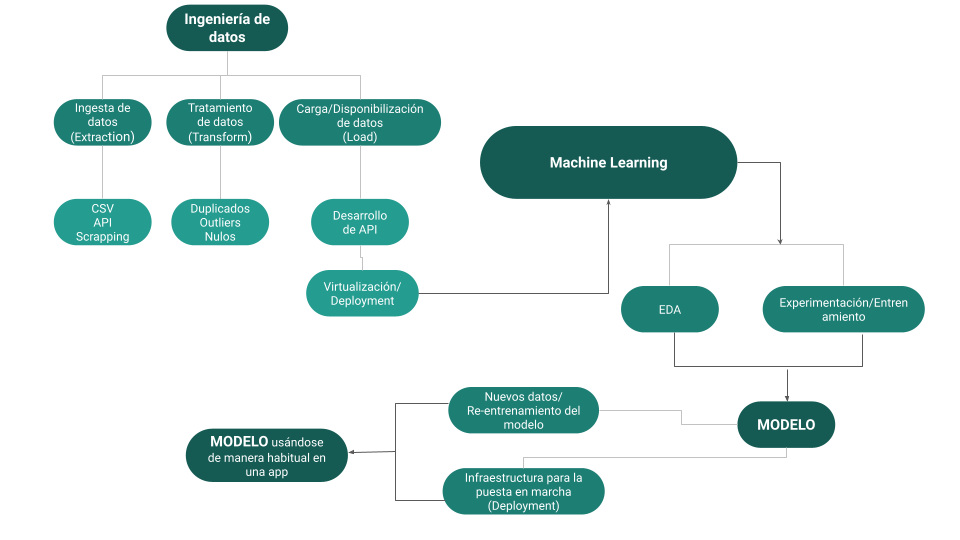

# <h1 align=center> **API for Movies Consult and Recommendation** </h1>

  

## **Context**

This project aims to include the entire experience of a MLOps Engineer process, from raw data to a deployed **MVP** (_Minimum Viable Product_) in just a few days. The project begins by gathering raw data from the TMDB API and then looks for an effective and fast process to achieve a deployed MVP. The exact goals of the project will be clarified in the following sections.

## **ETL**
The ETL step involves understanding the available data and performing any necessary transformations to improve its quality and flexibility for manipulation. This may involve cleaning the data, transforming it into a specific format, or performing other manipulations as necessary. 

The code for this stage is available in the ETL folder of this project.

  

## **API development**

In this step, an API is developed using the FastAPI framework. The API consists of 6 functions that will be consulted by the endpoints:

+ Total historical number of movies released in a given month.

    + **Input Parameters**: month (int)
    + **Output**: total number of movies released (int)
+ Total historical number of movies released on a given day of the week.

    + **Input Parameters**: day of the week (string)
    + **Output**: total number of movies released (int)
+ Score and year of release of a given movie.

    + **Input Parameters**: movie title (string)
    + **Output**: movie score and year of release (tuple)
+ Viewers' opinion of a movie measured by the vote average.

    + **Input Parameters**: movie title (string)
    + **Output**: viewers' opinion of the movie measured by the vote average (float)
+ Get information about actors, including the number and the average return of movies they have participated in.

    + **Input Parameters**: actor name (string)
    + **Output**: number of movies the actor has participated in and the average return (tuple)
+ Get information about directors, including the accumulated revenue, movies directed, and associated information regarding the movies.

    + **Input Parameters**: director name (string)
    + **Output**: accumulated revenue, movies directed, and associated information regarding the movies (dictionary)

 

## **Exploratory Data Analysis-EDA**

Once the data has been processed and normalized, an exploratory data analysis (EDA) is performed to look for patterns and trends in the data. The objective of this analysis is to achieve a better understanding of meaningful features in the available data, which can later be used to develop a recommendation system.

The analysis and visualizations performed during the EDA are available in the EDA folder of this project. 

 

## **Recommendation System**

Based on the EDA previously performed, it was concluded that an NLP-based approach would be best for developing the recommendation system. This approach was based on the hypothesis that numeric parameters such as popularity, average votes, budget, revenue, and return do not provide useful information for comparing the similarity between two movies based on their plot, theme, context, vibe, etc. Instead, features such as the movie's overview, genre, production companies, casting, and director were found to have a stronger correlation with these aspects.

To implement this approach, each movie was vectorized based on the most relevant "words" in the aforementioned features. This n-dimensional representation was then used to estimate the similarity between two movies using cosine distance. More information on this similarity measurement can be found in the following links:
+ [Link Medium Nº1](https://medium.com/@milana.shxanukova15/cosine-distance-and-cosine-similarity-a5da0e4d9ded)
+ [Link Medium Nº2](https://medium.com/geekculture/cosine-similarity-and-cosine-distance-48eed889a5c4#:~:text=Cosine%20similarity%20is%20a%20metric,they%20are%20to%20each%20other.)

Once the similarity between movies is quantified is a straightforward process to find the Top 5 movies with higher similarity score. 

The code developed to implement the mentioned process can be find in the RecommendationSystem folder of this project.

 

## **Deployment**

Finally, the API including the methods related to querying information of movies and asking for recommendations based on the title of a movie is dockerized based on a triangolo/uvicorn-gunivorn distribution and deployed in Render: [LinkToAPI](https://rendmovieapi.onrender.com/docs)

 **NOTE**: It should be considered that the API was deployed using the Free version of Render, therefore a minimal version was created to fit the available resources. 

## **Video**
A brief video showing the API working and explaining some of the developed code can be find [here](https://drive.google.com/file/d/1ScnhpF86KuLGEZgg1bwZK8Okork6fiTy/view?usp=sharing)